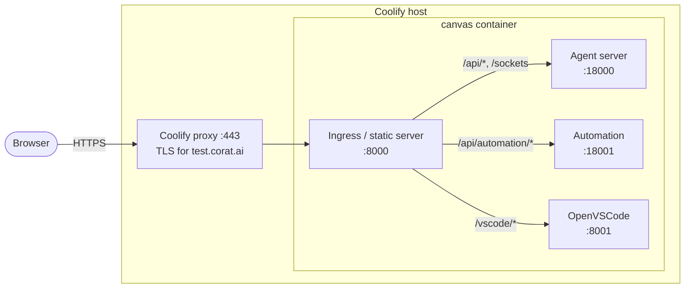

# Deploying Agent Canvas on Coolify

This guide deploys Agent Canvas to a domain — `test.corat.ai` in the examples —
using [Coolify](https://coolify.io) as the build and hosting layer. Coolify
builds the all-in-one Docker image from this repository, runs it, and puts its
own reverse proxy in front with automatic Let's Encrypt TLS.

> [!WARNING]
> Agent Canvas drives an agent that can read and write the filesystem it runs
> on, execute shell commands, and reach the network. Here that filesystem is
> the container's, but the container still sits on your Coolify host and shares
> its network. **Anyone who can talk to the agent server can do all of that.**
> The API key configured below is what stands between the public internet and
> that capability — treat it like a production credential. The threat model in
> [SELF_HOSTING.md](./SELF_HOSTING.md) applies here too.

## How the pieces fit



Everything is one container behind one port. [`docker-compose.yaml`](../docker-compose.yaml)
in the repository root is the deployment definition; Coolify reads it directly.
It replaces the nginx + certbot half of [SELF_HOSTING.md](./SELF_HOSTING.md) —
the rest of that guide still describes what you are running.

## 1. Point the domain at the host

Create an `A` record for `test.corat.ai` pointing at the Coolify server's
public IPv4, and confirm it resolves before deploying — Let's Encrypt issues
the certificate during the first deploy and needs the name to be live:

```bash
dig +short test.corat.ai
```

Ports 80 and 443 must be open on the host: 80 for the ACME HTTP-01 challenge,
443 for the app.

## 2. Create the resource in Coolify

**+ New → Resource → Application → Docker Compose**, then:

| Field | Value |
| --- | --- |
| Repository | your fork/clone of this repository |
| Branch | `main` |
| Base directory | `/` |
| Docker Compose location | `/docker-compose.yaml` |

For a private repository, connect a GitHub App or add a deploy key in Coolify
first — the build runs on the Coolify host and clones the repo there.

Then open the resource's **Domains** tab and point the `canvas` service at
`https://test.corat.ai`, port 8000.

Coolify can also take the domain from inside the compose file, through its
`SERVICE_FQDN_<SERVICE>_<PORT>` magic variable — but that has to be written as
an `environment` entry with no value, and Coolify rewrites this file before
handing it to compose in a way that turns valueless entries into numeric keys
compose refuses to load. Hence the Domains tab.

## 3. Set the environment variables

Generate the API key once and keep a copy; you paste it into the UI on every
new browser:

```bash
openssl rand -base64 32
```

Then add these under the resource's **Environment Variables**:

| Variable | Value | Notes |
| --- | --- | --- |
| `LOCAL_BACKEND_API_KEY` | the generated key | **Required.** Mark it as a secret. Left unset, the entrypoint generates one into the state volume that nobody has seen, and the entry screen becomes unpassable until you read it back out of the container log. |
| `AUTOMATION_BASE_URL` | `https://test.corat.ai` | Goes into automation callback URLs and is injected into sandboxes, so it has to be the public origin and not the container-local default. |
| `OH_SECRET_KEY` | 32 random hex bytes (optional) | Encrypts stored settings and secrets. Auto-generated into the volume on first boot; set it explicitly if you want saved secrets to survive the volume being recreated. |
| `AGENT_CANVAS_BASIC_AUTH_USER` + `AGENT_CANVAS_BASIC_AUTH_PASSWORD` | a name and a long random password (optional) | Puts HTTP basic auth in front of the whole origin. Required if you set `AGENT_CANVAS_AUTH_REQUIRED=false` — see [Two ways to keep strangers out](#two-ways-to-keep-strangers-out). |
| `AGENT_CANVAS_AUTH_REQUIRED` | `false` (optional) | Drops the API key entry screen and bakes the key into the page. Only with basic auth in front of it. |
| `VITE_DO_NOT_TRACK` | `1` (optional) | Disables telemetry in the frontend bundle and both backends. |

`AGENT_CANVAS_AUTH_REQUIRED` defaults to `true` in the compose file. The
section below is what it costs to change that.

## 4. Deploy

Hit **Deploy**. The first build compiles the frontend with `npm ci && npm run
build` inside the image, which is the slow part: budget roughly ten minutes and
at least 4 GB of RAM on the build host. If Coolify's build times out, raise the
timeout in the resource's advanced settings rather than retrying blindly.

Once the container reports healthy, open `https://test.corat.ai/`. With the
compose defaults you get the **API key entry screen** — paste
`LOCAL_BACKEND_API_KEY` and you land in Agent Canvas; with basic auth
configured instead you get the browser password prompt and land there directly.
The bundled editor is at `/vscode`, on the same origin and port.

Verify from a shell:

```bash
curl -I https://test.corat.ai/          # 200
curl -I http://test.corat.ai/           # 301/308 to https
```

## Two ways to keep strangers out

Something has to stand in front of this origin, because loading the page is
enough to drive an agent that has a shell. There are two supported shapes, and
the difference is only where the credential is asked for.

**Public mode** — `AGENT_CANVAS_AUTH_REQUIRED=true`, the compose default. The
static server serves the frontend without baking the session key into the HTML,
so every visitor pastes `LOCAL_BACKEND_API_KEY` into the entry screen. The
browser keeps it in `localStorage`, so it is once per browser, not once per
visit. Nothing else is needed.

**Basic auth** — `AGENT_CANVAS_AUTH_REQUIRED=false` plus
`AGENT_CANVAS_BASIC_AUTH_USER` and `AGENT_CANVAS_BASIC_AUTH_PASSWORD`. The key
goes back into the HTML, so the app never asks for it; instead the ingress
challenges every request — static files, `/api`, the websockets and the editor
alike — and the browser replays the saved password on its own. In practice
visitors type nothing after the first prompt.

The ingress enforces this rather than a proxy middleware because Coolify
derives its Traefik router names per resource, so a middleware cannot be pinned
in the compose file.

> [!WARNING]
> `AGENT_CANVAS_AUTH_REQUIRED=false` **without** the basic auth pair is the one
> combination to avoid: the key is in the page and nothing guards the page, so
> anyone who resolves the hostname has a shell on the container. A domain is
> not a secret — certificate transparency logs publish every name you issue a
> certificate for.

Either way the session key is checked on every `/api/*` call as the
`X-Session-API-Key` header, by the agent server and the automation backend
alike, so a wrong or missing key fails at the backend rather than only in the
UI.

> [!NOTE]
> **The bundled editor shares the canvas's browser origin.** OpenVSCode is
> served under `/vscode` on the same port rather than on a hostname of its own.
> Script running anywhere on that origin can read the canvas's `localStorage`,
> which holds the session API key of every backend registered in that browser.
> Tracked in [#16492](https://github.com/OpenHands/OpenHands/issues/16492).

## Persistence

Two named volumes, declared in the compose file and managed by Coolify:

| Volume | Mount | Holds |
| --- | --- | --- |
| `canvas-state` | `/home/openhands/.openhands` | Settings, secrets, generated keys, conversations, the automation SQLite DB |
| `canvas-projects` | `/projects` | Code the agent reads and edits |

They survive redeploys. Deleting them resets the deployment to a first boot,
including regenerating `OH_SECRET_KEY` — which makes previously stored secrets
unreadable.

## Serving under a subpath instead

The app is served at the domain root because `VITE_BASE_PATH` and
`AGENT_CANVAS_BASE_PATH` both default to `/` here. To mount it under a prefix,
set **both** to the same value (e.g. `/canvas`): the first is baked into the
bundle's asset URLs at build time, the second tells the static server where to
mount. A mismatch produces a blank page, not a redirect.

## Updating

Coolify redeploys on push once the webhook is enabled, or on demand. The agent
server and automation versions are pinned as build args in
`docker-compose.yaml`, mirroring [`config/defaults.json`](../config/defaults.json)
— bump both together, or override `AGENT_SERVER_IMAGE` / `AUTOMATION_VERSION`
as environment variables in Coolify to try a version without a commit.

## Troubleshooting

| Symptom | Cause |
| --- | --- |
| Blank page, 404s on `/assets/*` | `VITE_BASE_PATH` and `AGENT_CANVAS_BASE_PATH` disagree. The first is baked in at build time, so changing the env var alone is not enough — rebuild. |
| Build fails with `non-string key in services.canvas.environment: 0` | The `environment:` block is in `- KEY=value` list form, or an entry has no value at all. Coolify rewrites the compose file and re-emits those entries under numeric keys, which compose rejects. Use the mapping form and give every entry a value. |
| Build fails with exit 1 before any build output | A compose interpolation error, not a build error. Coolify resolves every `${...}` in the file for `docker compose build` as well, against `/artifacts/build-time.env` — which need not carry runtime secrets. So a `${VAR:?...}` guard on a runtime-only value aborts the build with nothing but the command echoed. Keep runtime secrets as plain `${VAR:-}`. |
| The entry screen rejects the key | The container did not get the value you think it did. `docker exec <container> printenv LOCAL_BACKEND_API_KEY` shows what it actually received; a redeploy is needed after changing it. |
| 502 from the proxy right after a deploy | The container is up but the agent server is still starting. The healthcheck allows 120 s for this; the logs end with `All services started` when it is done. |
| Container marked unhealthy | The ingress process exited — its log line is `Static server (PID …) exited`. |
| Live agent output never arrives | Websocket upgrades are not reaching the container. Coolify's proxy handles them by default, so look for a custom proxy configuration or a CDN in front of the domain. |
| Every request returns 401 with a browser password prompt | Basic auth is on. Check `AGENT_CANVAS_BASIC_AUTH_USER` / `AGENT_CANVAS_BASIC_AUTH_PASSWORD`; the startup log prints `Basic auth: required` when it is active. |
| Build killed | Out of memory during the Vite build. Give the build host more RAM. |
